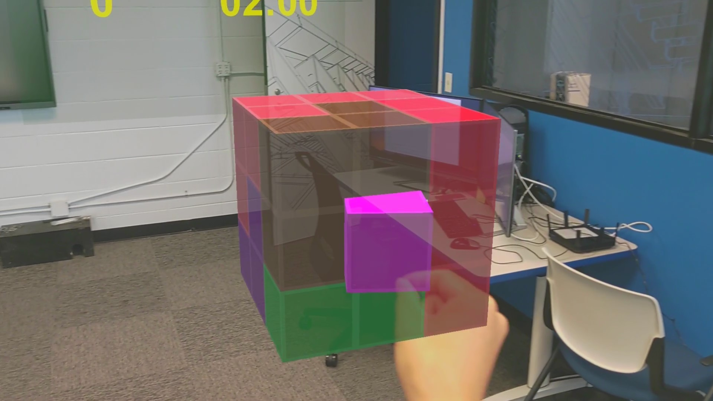
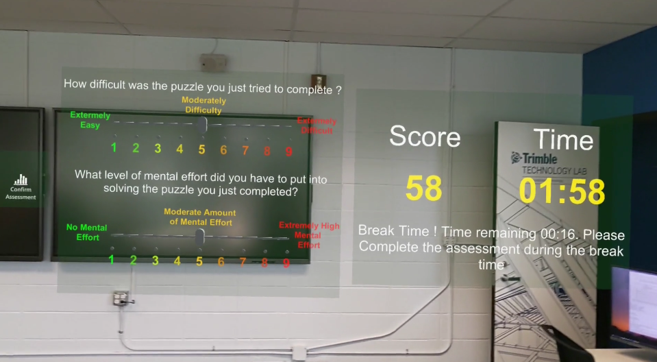

## Table Of Contents
* [Introduction](#introduction)
* [Some Cool Medias of the Game](#some-cool-medias-of-the-game)
* [Generate The Puzzle File](#generate-the-puzzle-file)
* [Setup Unity and Azure](#setup-unity-and-azure)

## Introduction
This project aims to develop a puzzle game for Mixed Reality Environment as Hololens 2 (on which I have worked). This puzzle game challenges the user to solve 3d holographic puzzle games. There is 3 different level of difficulty. A tutorial is also implemented to teach the user how to interact with Holographic pieces.

  

As this game was used for data collection purposes, for each session (1/2/3) the game analytics are saved on the Hololens storage and an Azure container using blobs (Thanks to <a href="https://github.com/Unity3dAzure/StorageServices">this unity package</a>). The analytics collected are :
* Time
* Player Position and Rotation
* Puzzle ID
* Level of Difficulty
* Time to solve
* Mental Effort the user had to put in a puzzle to solve it (player assessment)
* Difficulty of the puzzle felt by the user (player assessment)
* Puzzle state (every second)

## Some Cool Medias of the Game

  

  

  

## Generate the Puzzle file
The puzzle played in the game are pre-generated with the python notebook **Game_mx.ipynb**, with this script you can generate 200 (or how many you want) puzzles and write the grid in a json file. This file will be loaded when the user launches a game session. To generate this json file:
1. Open the jupyter notebook (requirements Python 3.X and numpy)
2. Use the function generate_json("puzzle_data.json",SIZE_OF_PUZZLE,NUMBER_OF_PIECES,STANDARD_DEVIATION_OF_PIECE_SIZE,STD_INTERVALL) and replace : 
    * SIZE_OF_PUZZLE by an integer N (the puzzle grid generated will be a N x N x N matrix). N = 4 for example
    * NUMBER_OF_PIECES by an integer K which is the number of pieces in your grid. K = 11 for example
    * STANDARD_DEVIATION_OF_PIECE_SIZE by a float S which is the standard deviation of the piece size. S = 1.6 for example
    * STD_INTERVAL by a float I which represents the interval such as a grid is considered valid if the standard deviation of the piece size is in the interval \[S-I;S+I\]. I = 0.1 for example
3. Your puzzle grid json file is generated in the same folder as **Game_mx.ipynb**. Note that the name *puzzle_data.json* can be changed but requires modifying Read_Write_json.cs file in the unity package 

## Setup Unity and Azure
If you want to use or modify the game :
1. Create a new 3d core Unity Project (version 2020.3.28f1 or above to avoid UnityWebRequest issue).
2. Set up your Project for Mixed Reality using <a href="https://github.com/microsoft/MixedRealityToolkit-Unity">MRTK</a>. This <a href="https://docs.microsoft.com/en-us/learn/modules/learn-mrtk-tutorials/1-3-exercise-configure-unity-for-windows-mixed-reality?tabs=openxr">tutorial</a> gives all the guidelines to set up your project.
3. Then in Unity : Assets>Import Package>Custom Package... and select the Game.unitypackage.
4. Open the scene "Game_MX" in the file scene.
5. In Unity : Edit>Project Settings>Player>Publishing Settings>Capabilities check :
    

      
Click to see all requirements

    :white_check_mark: Internet client  
    :white_check_mark: Internet Client Server  
    :white_check_mark: PrivateNetworkClientServer  
    :white_check_mark: RemovableStorage  
    :white_check_mark: SharedUserCertificates  
    :white_check_mark: WebCam  
    :white_check_mark: Microphone  
    :white_check_mark: HumanInterfaceDevice  
    :white_check_mark: CodeGeneration  
    :white_check_mark: SpatialPerception  
    :white_check_mark: InputInjectionBrokered  
    :white_check_mark: LowLevelDevices  
    :white_check_mark: PointOfService  
    :white_check_mark: RecordedCallsFolder  
    :white_check_mark: RemoteSystem  
    :white_check_mark: SystemManagement  
    :white_check_mark: UserDataTasks  
    :white_check_mark: UserNotificationListener  
    :white_check_mark: GazeInput  
    

- - - -
In our case, we used Azure to load the puzzle file grid (that was stored on an azure container) feel free to load the file directly from the device by modifying the code.
If you want to use this solution, you will need to configure Azure : 

6. Create/Sign in with an azure account.
7. Go to Storage accounts and create a new storage account
    * Basics : Name : **mxdatacollection** - Region : your choice - Performance : your choice - Redundancy : your choice
    * Advanced : Require secure transfer for REST API operations : **DISABLED**
8. Once the storage account is created, click on it and create 2 new containers in it (choose **Blob** or **Container** for *Public Access Level*) named **data** and **puzzlejson**.

(Note that all proposed names can be changed, yet you will need to modify them in the c# script Read_Write_json.cs)

9. Upload the puzzle grid json file "puzzle_data.json" in the puzzlejson container.
10. In azure go to your Storage Account>Access Key and copy one of the key values and paste it as the value of the variable *accessKey* in the script *Read_Write_json.cs*.
- - - -
11. Build your Unity Project.
12. When your unity project will be build : go to the built file and open ./*Nameofyourapp*/Package.appxmanifest and in the section <Capabilities> add the line : **<uap:Capability Name="documentsLibrary"/>** and save it.
13. Deploy your solution on your device.
14. You are ready to play !
