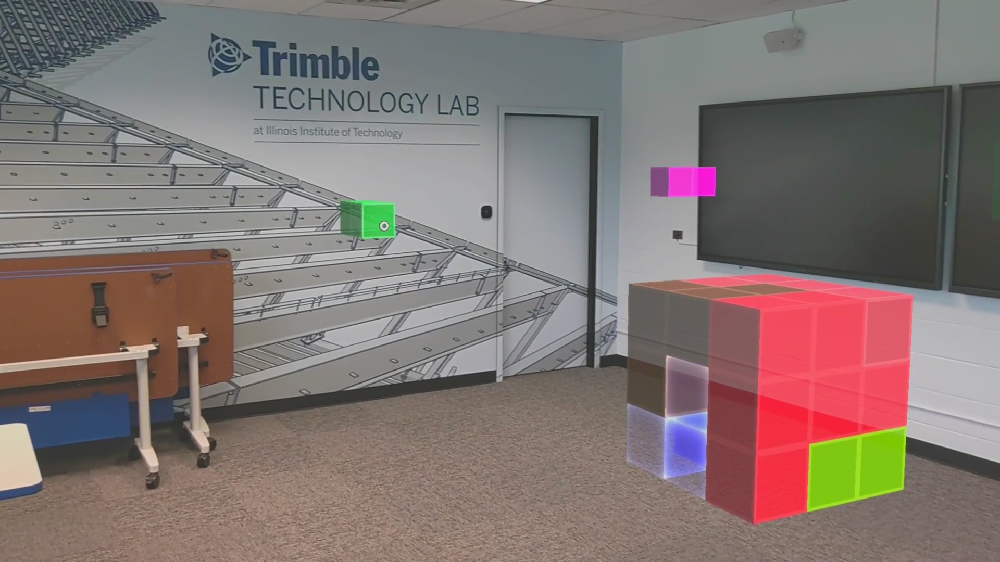

## Table Of Contents
* [Introduction](#introduction)

## Introduction
This project aims to develop a puzzle game for Mixed Reality Environment as Hololens 2 (on which I have worked). This puzzle game challenges the user to solve 3d holographic puzzle game. There is 3 different level of difficulty. As this game was used for data collection purpose, for each session (1/2/3) the game analytics are saved on the Hololens storage and on an Azure container using blobs (Thanks to <a href="https://github.com/Unity3dAzure/StorageServices"> this unity package</a>). A tutorial is also implemented to teach the user how to interact with Holographic pieces.

  

